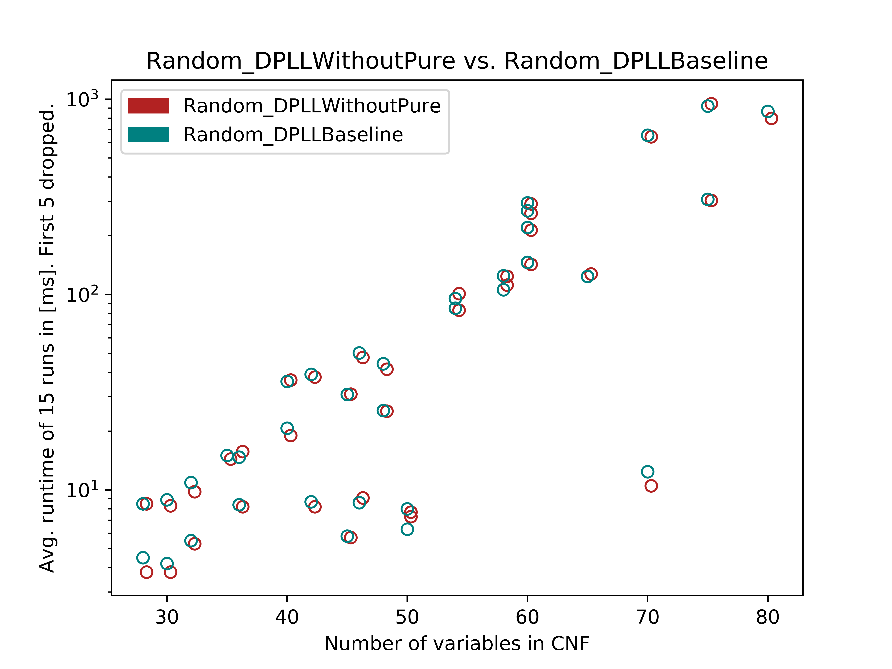
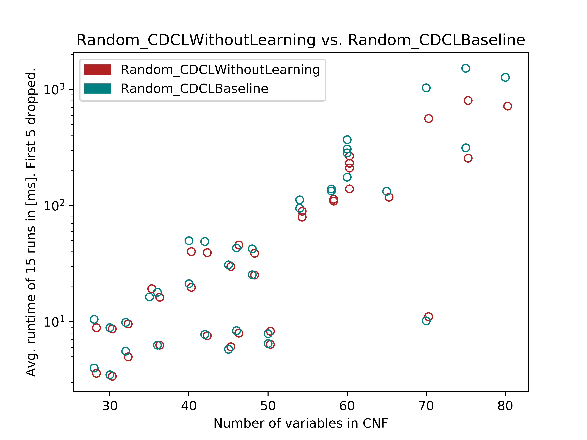
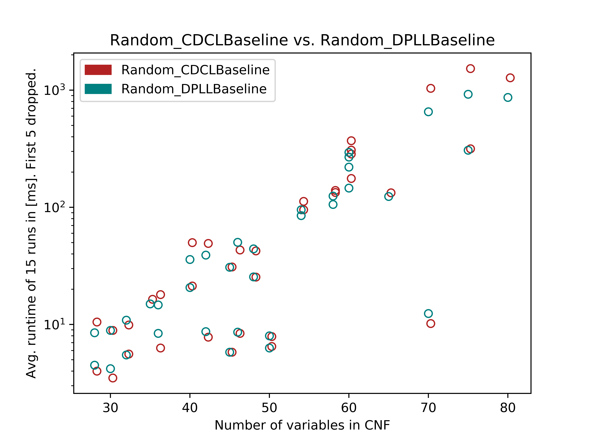

# Program verification - Assignment 1
**Jakub Lichman** and **Kostas Triantafyllou**

## CNF Conversion

CNF conversion is implemented in two files: CNF.scala (tseitin part) and CNFConverter.scala (all other parts as static methods). We added two more tests for tseitin conversion - random and exhaustive one.

### Tseitin CNF conversion vs. Disjunction distribution

After implementation of tseitin CNF conversion and its usage for converting formulas into CNF format we have decided to use it for convertion of formula generated by Sudoku solver into CNF format. 
However, during implementation of sudoku it turned out that tseitin conversion is not efficient for this type of problem because it introduces many new variables. 
While in theory tseitin conversion does not introduce computing overhead, in reality it does.
Difficulty of formula in term of decisions is not increaded by tseitin because it introduces many variables which are tightly correlated. 
However this correlation causes meny consequent unit propagations which in case of wrong decision need to be undone. 
This step causes huge overhead that causes that formula is not solvable in reasonable time while in disjunction distribution case it takes no more than two seconds for easy and medium problems and up to 6 seconds for difficult ones. 

As a consequence we wanted to see performance of both techniques in terms of formula conversion and consequent performance of solvers over converted formula.
Following table shows average performance of these techniques in formula conversion.

| Conversion        | Dis. distribution   | Tseitin   |
| ----------------- |:-------------------:| ---------:|
| 100 Random tests  | 12.5532s            | 9.2112s   |
| 100 Exhaustive    | 3.2045s             | 2.4605s   |

**Table 1.** shows that tseitin conversion is faster but not suitable for sudoku solving. 

## SAT Algorithms
We have implemented the DPLL and CDCL algorithms as are described in the lectures. They are implemented in a way where we can reuse majority of DPLL code in CDCL. Therefore DPLL is base class of CDCL. Both solvers take multiple parameters so we can try different solving strategies.

Arguments of DPLL:
* usePureLiteralRule: Boolean
* useTseitinConversion : Boolean
* strategy: String

Strategy can be set to following values: {"first", "smallest", "random"} where "first" represents strategy where next decision literal is chosen from first not disabled clause and it becomes first undisabled literal in this clause. In "smallest" strategy literal is picked from currently smallest clause and in "random" choice is decision literal chosen randomly. Although this allowes us to create up to 12 different configurations, not all of them make sense. For instance useTseitinConversion argument makes no effect if given formula is already in cnf (it usually is). 

Therefore we have decided to compare DPLL with and without pure literal rule and all decision literal choosing strategies. For both DPLL and CDCL we have decided to split tests into two categories: random and structured ones (We are not showing all results but you can find them in the same folder as README). The results are as follows:

**Fig. 1.** shows that in random cases pure literal rule makes no effect or even slows down the solving.

In CDCL we introduced one more parameter which indicates whether we should use *clause learning* or not. With this additional parameter we can create 24 different configurations but again majority of them make no sense. For instance, we have learned from DPLL case that pure literal rule makes very small effect so we can omit it. 

As an result of that we have decided to compare CDCL with and without clause learning and all decision literal choosing strategies. Tests are also split into random and structured ones and results are as follows:

**Fig. 2.** shows that in random cases clause learning takes no effect or even slows down the solving.

**Fig. 3.** shows comparison between CDCL and DPLL in their basic configurations on random samples.

| Test name          | DPLL Baseline   | DPLL Without Pure  | CDCL Baseline | CDCL Without Learning  |
| ------------------ |:---------------:| :-----------------:|:-------------:|:----------------------:|
| flat75-6.cnf       | 421.9ms         | 429.8ms            | 446.6ms       | 419.8ms                |
| uf100-0466.cnf     | 847.7ms         | 869.5ms            | 1408.4ms      | 709.5ms                |
| flat75-4.cnf       | 120.5ms         | 119.8ms            | 124.8ms       | 121.5ms                |
| flat75-20.cnf      | 2189.1ms        | 2131.8ms           | 2564.6ms      | 1760.3ms               |
| uf100-068.cnf      | 3761.1ms        | 3842.0ms           | timeout       | 3367.9ms               |
| flat75-15.cnf      | 1434.2ms        | 1694.9ms           | 782.8ms       | 641.9ms                |
| par8-3-c.cnf       | 8.5ms           | 8.4ms              | 8.6ms         | 8.0ms                  |
| anomaly.cnf        | 6.4ms           | 5.6ms              | 6.0ms         | 5.3ms                  |
| flat75-12.cnf      | 5148.0ms        | 5110.4ms           | 4126.2ms      | 2687.2ms               |
| ais8.cnf           | 1123.4ms        | 1107.9ms           | 1259.7ms      | 1134.9ms               |

**Table 2.** shows results for structured formulas (except "uf100*" which are uniform random 3-SAT problems). "Flat*" formulas represents graph coloring, "par*" parity problems and "ais*" all intervall series. We can see that in structured tests is CDCL faster but our clause learning is not efficient enough to speed up solving. 

## Sudoku

We also implemented bonus task - sudoku by encoding mechanism described in [paper](https://pdfs.semanticscholar.org/535d/06391275618a7b913d1c98a1353286db8d74.pdf) written by Inês Lynce and Jöel Ouaknine. They presented two approaches but we picked minimal encoding that looked more readable to us. All tests even the hardest ones are able to finish within 30 seconds with CDCLBaseline solver. We did not try other solvers since CDCL is clearly faster than DPLL on structured tests.

### Sudoku performance

After successful validation of our sudoku implementation we have decided to test the performance of selected solver configurations. It turned out that there is no clear winner. Formula is in every sudoku almost identical except the conjoined literals that are part of initial number distribution over grid. It is interesting to see that these small modifications caused different performances of solvers. We have picked few represenatives that represent patterns that repeat in results. Three most common patterns are where DPLL Baseline is much faster than the other solvers (sudoku 9 and 10), DPLL Baseline is much slower than the others (suduko 35 and 38) and pattern where all four solvers managed to solve the formula in more or less the same time. You can see all interesting results including those with the observed patterns in the next table:

| Sudoku test        | DPLL Baseline   | DPLL Without Pure  | CDCL Baseline | CDCL Without Learning  |
| ------------------ |:---------------:| :-----------------:|:-------------:|:----------------------:|
| sudoku9.txt        | 3224.4ms        | 5150.2ms           | 6039.8ms      | 5445.6ms               |
| sudoku10.txt       | 2222.6ms        | 2812.8ms           | 2745.2ms      | 2799.2ms               |
| sudoku35.txt       | 1780.0ms        | 1127.0ms           | 1016.6ms      | 1162.2ms               |
| sudoku38.txt       | 1507.8ms        | 1094.4ms           | 1082.4ms      | 1063.0ms               |
| sudoku5.txt        | 1057.2ms        | 1110.8ms           | 1091.4ms      | 1430.6ms               |
| sudoku11.txt       | 1100.8ms        | 2133.2ms           | 1221.8ms      | 1193.4ms               |
| sudoku13.txt       | 1290.2ms        | 1314.0ms           | 1400.4ms      | 1350.4ms               |
| sudoku3.txt        | 1368.4ms        | 1436.8ms           | 1456.8ms      | 1445.8ms               |
| sudoku18.txt       | 1574.6ms        | 1666.0ms           | 1296.6ms      | 1313.0ms               |

**Table 3.** shows solving time of selected sudoku problems.

We can see that pure literal rule in most cases actually slowes down solving but in two of them shown in table above it makes solving much faster. It these cases it is probable that pure literal rule is done in early stages of the algorithm and it avoids unnecessary decisions. However such a difference was unexpected from our side. Clause learning also does not help because just in sudoku5 case it made the algorithm faster. We think that it is caused by structure of the formula where same problem does not appear many times and so learned clauses make algorithm slower because they make formula bigger.

* *All tests were run 15 times and we dropped first 5 runs and took average of remaining 10.*
* *Structured tests were taken from [SATLIB](http://www.cs.ubc.ca/~hoos/SATLIB/benchm.html)*
* *You can find all results of sudoku in [sudoku](sudoku) folder.*
* *All tests we run on MacBook Pro 2.7 GHz Intel Core i5, 8 GB 1867 MHz DDR3*
